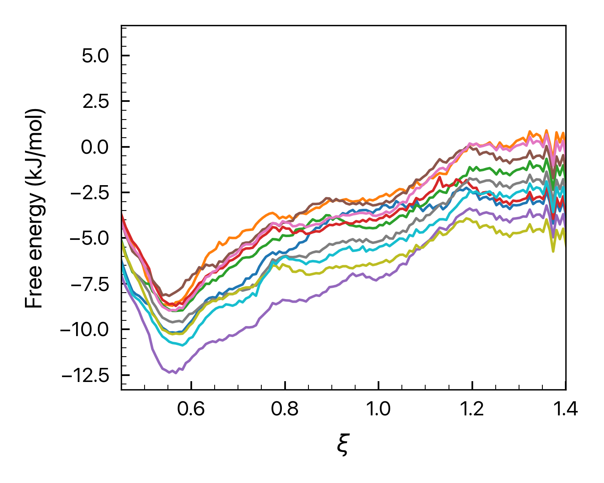
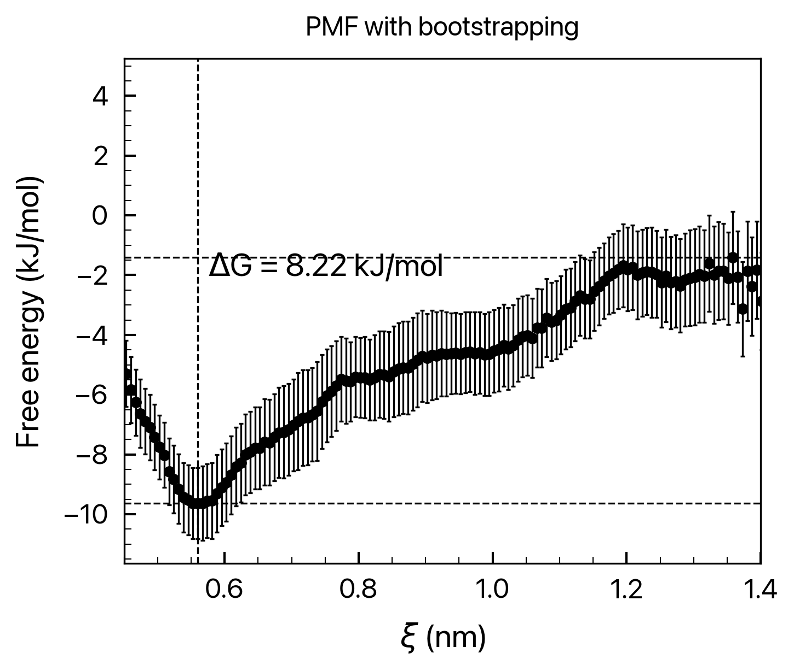
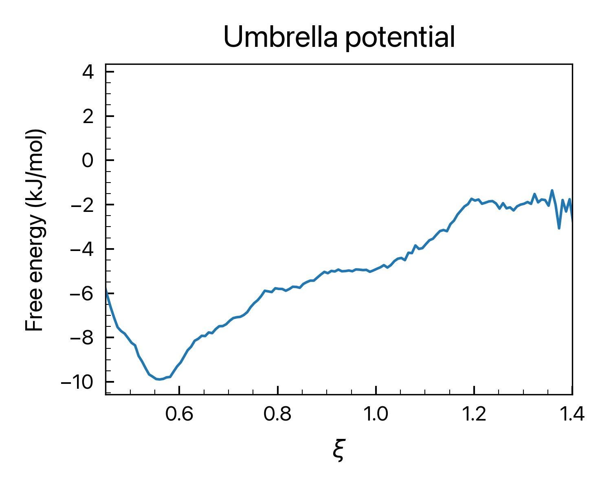

# **WHAM_plotter**

## **What is this?**

__WHAM_plotter__ is a repository that provides code snippets to sort and visualize the raw data obtained from free energy calculations using GROMACS (i.e. umbrella sampling). This README file explains how to use the provided code snippets and provides a brief overview of the files contained in the repository.

## **PREVIEW**
The brief WHAM results are same as follow:

| `bsProfs.png` | `bsResult.png` | `profile.png` |
| :-------: | :-------: | :-------: |
|  |  |  |

cf. I have to note that I didn't simulate enough time to equilibrate each window. The free energy curve would be smoother and better established if you allow for a substantial amount of equilibration time.

## **How to use?**

To use this repository, the user should first ensure that they have computed each simulation window in the folder entitled `window_{}` (e.g.`window_1`, `window_2`, ..., `window_n`). These `window_{}` folders should be located in the folder named window_folders. Therefore, the folder tree looks like:

```text
└── window_folders
    ├── window_1
    │   └── [FORCEFIELD].ff
    ├── window_2
    │   └── [FORCEFIELD].ff
    ├── window_3
    │   └── [FORCEFIELD].ff
    ├── window_4
    │   └── [FORCEFIELD].ff
    ├── window_5
    │   └── [FORCEFIELD].ff
    ...
```

You can place all the python3 code snippet files into the same directory where the `window_folders` is located.

### **(1) Sort your result files into `WHAM` folder**

To initiate the sorting sequences, run the prepareWHAM.py file by typing the following command in the terminal:

```shell
python3 prepareWHAM.py
```

This command will sort every `umbrella_{}.tpr`, `umbrella_{}_pullx.tpr`, and `umbrella_{}_pullf.tpr` file into the `./WHAM` folder. Additionally, it will create `tpr-files.dat`, `pullx-files.dat`, and `pullf-files.dat` files, which contain the filenames of the `umbrella_{}.tpr`, `umbrella_{}_pullx.xvg`, and `umbrella_{}_pullf.xvg` files, respectively. These files are essential for running the `gmx wham` command.

### **(2) Run `gmx wham` with your installed GROMACS package**

Run `gmx wham` command by typing something like:

```shell
gmx wham -it tpr-files.dat -if pullf-files.dat -o -hist -unit kJ -nBootstrap 100 -temp 270
```

or

```shell
gmx wham -it tpr-files.dat -ix pullx-files.dat -o -hist -unit kcal -nBootstrap 50 -temp 280
```

WHAM sequences will be automatically initiated.

### **(3) Plot your graphs**

Finally, run the other Python3 files (`rcparams.py`, `plotprofile.py`, `plothisto.py`, `plotbsprofs.py`, `plotbsresult.py`) to plot the result graphs. Originally, `xmgrace`, which is the X-GUI-based plotting software, should be used to check these results. However, by running these Python3 files, the user can check the results instantaneously.

## **File lists**
This repository contains the following files:

- `prepareWHAM.py`: Sorts result files into the WHAM folder and creates the `tpr-files.dat`, `pullx-files.dat`, and `pullf-files.dat` files.
- `rcparams.py`: Sets the plot parameters, such as font sizes, line widths, and colors.
- `plotprofile.py`: Plots the free energy profile obtained from the WHAM calculation.
- `plothisto.py`: Plots the histogram of the WHAM result.
- `plotbsprofs.py`: Plots the bootstrap free energy profiles.
- `plotbsresult.py`: Plots the bootstrap histogram and error bars.
